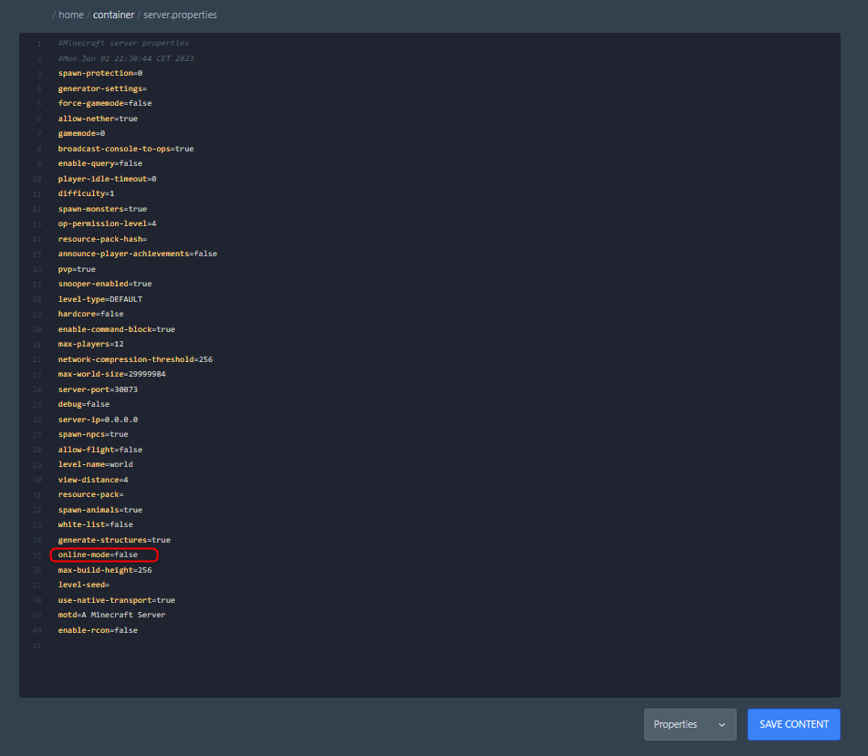

# Making your Server cracked

1. Open the FTP Panel And Go To the Server files
2. Find Server.properties
3. Open it And Find Online-Mode
4. Change true to false

Now You Can Finally Play With Your Friends!&#x20;


We dont recommend playing a cracked version of minecraft.&#x20;

